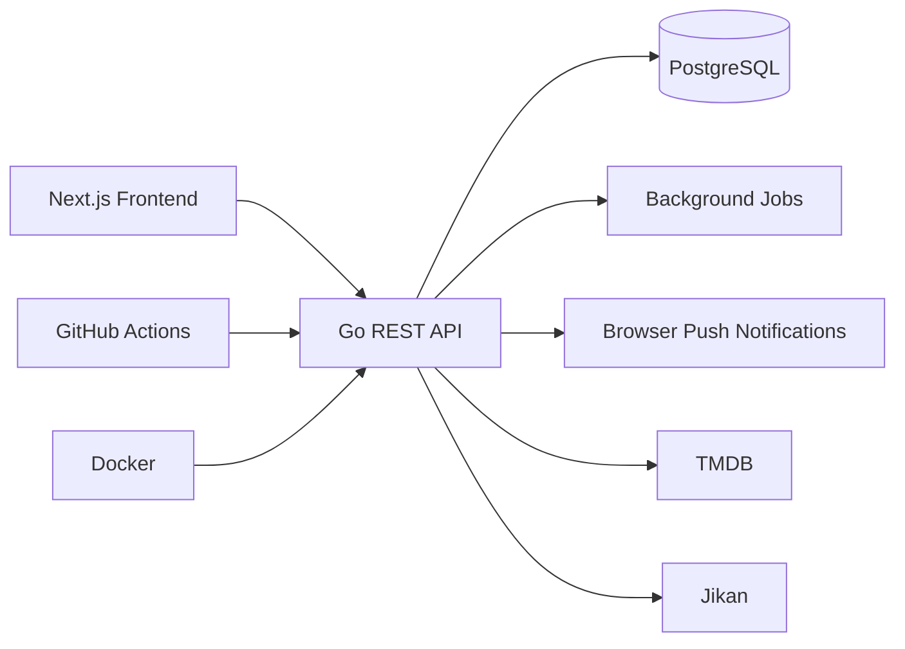

# Hi, I'm Pamilerin Sodeke 👋

# ...call me Praise tho

### Backend-Focused Full Stack Engineer

I build production-ready software with **Go**, **Next.js**, and **PostgreSQL**, with a strong focus on backend engineering, system design, and clean architecture.

I'm currently building **Airdate**, a release tracking platform that helps users stay up to date with movies, TV shows, and anime.

---

# About Me

I'm a software engineering student passionate about building products that are reliable, scalable, and enjoyable to use.

While I enjoy working across the full stack, my strongest interest is backend engineering—designing APIs, modeling data, integrating external services, and building systems that remain maintainable as they grow.

I enjoy solving real engineering problems rather than simply assembling features.

---

# 🚀 Featured Project — Airdate

**Airdate** is a production-oriented release tracking platform for movies, TV series, and anime.

Instead of being another CRUD project, Airdate brings together multiple services into a cohesive platform focused on helping users never miss upcoming releases.

### Engineering Highlights

- Go backend powering the application's business logic
- Next.js frontend
- PostgreSQL persistence
- OAuth authentication
- Browser Push Notifications
- Dockerized deployment
- GitHub Actions CI
- Background jobs for scheduled processing
- TMDB integration
- Jikan integration

### Architecture

🌐 **Live Demo**

https://airdatee.me

---

# Professional Experience

## Full Stack Engineering Intern

**Brandevia Africa**

Worked alongside the engineering team to develop and maintain production web applications, contributing features across both frontend and backend while collaborating within an existing codebase.

---

# Engineering Interests

I'm particularly interested in:

- Backend Engineering
- Distributed Systems
- API Design
- Database Design
- Cloud Infrastructure
- Developer Experience
- System Architecture

---

# Engineering Philosophy

> Good software is simple to understand, reliable to operate, and easy to improve.

I try to build systems that prioritize:

- Maintainability over cleverness
- Readability over unnecessary abstraction
- Reliability over premature optimization
- Long-term scalability

---

# Current Focus

I'm currently improving my knowledge of:

- Advanced Go
- PostgreSQL optimization
- Distributed systems
- Caching strategies
- Cloud infrastructure
- Software architecture

---

# Recognition

🏅 AWS × Udacity AI/ML Scholarship Recipient

---

# Technologies

### Languages

Go • TypeScript • JavaScript

### Frontend

Next.js • React • Tailwind CSS

### Backend

Go • PostgreSQL • OAuth • JWT

### DevOps

Docker • GitHub Actions • Railway • Vercel • Linux

---

# Let's Connect

I'm currently looking for Software Engineering internship opportunities where I can contribute to meaningful products while continuing to grow as an engineer.

- 🌐 https://airdatee.me
- 💼 LinkedIn: https://www.linkedin.com/in/pamilerin-sodeke-10b66138b
- 🐙 GitHub: https://github.com/PRAIZZZ-08
- ✉️ Feel free to reach out!
